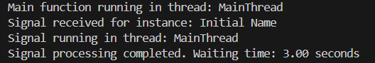
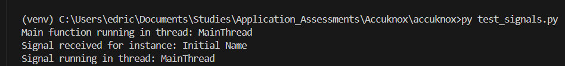
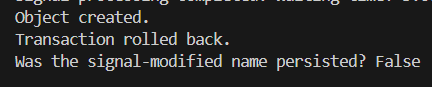
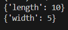

# AccuKnox Assignment

Accuknox folder contains the codes for the Topic: Django Signals

Python_assignment folder contains the codes for the Topic: Custom Classes in Python

Report file contains the detailed answers to the all questions in the assignment.
Report also included here for ease.


# Questions for Django Trainee at Accuknox

## Topic: Django Signals

### Question 1: 
By default are django signals executed synchronously or asynchronously? Please support your answer with a code snippet that conclusively proves your stance. The code does not need to be elegant and production ready, we just need to understand your logic.

### Answer 1:
By default, Django signals are executed synchronously.
Django signals are executed in the same thread and the same transaction as the caller. This means that the signal handler code runs immediately as part of the same operation that triggered the signal, and it blocks the execution until the signal handler completes.

Code Snippet – 

```plaintext
#Define a signal handler to test all points
@receiver(post_save, sender=MyModel)
def my_handler(sender, instance, **kwargs):
    # Prevent recursive save operations
    if instance.name == "Signal Modified":
        return

    print(f"Signal received for instance: {instance.name}")
    
    # Test if the signal is in the same thread
    print(f"Signal running in thread: {threading.current_thread().name}")
    
    start_time = time.time()
    
    # Simulate a long-running process to prove synchronous behavior
    time.sleep(3)  # This will block the main thread if signal is synchronous
    
    # Record the end time
    end_time = time.time()
    
    # Calculate and print the waiting time
    waiting_time = end_time - start_time
    print(f"Signal processing completed. Waiting time: {waiting_time:.2f} seconds")
    
    # Modify the instance to test transaction rollback
    instance.name = "Signal Modified"
    instance.save()
```

Output that explains answer  – 



```plaintext
Main function running in thread: MainThread
Signal received for instance: Initial Name
Signal running in thread: MainThread
Signal processing completed. Waiting time: 3.00 seconds
```


Explanation – 

The output indicates that the signal handler was executed immediately after the instance was created and that the thread running the signal handler is the same as the main thread where the instance was created. The time.sleep(3) in the handler blocks execution, which demonstrates that the signal processing is synchronous as it holds up the main thread.


### Question 2: 
Do django signals run in the same thread as the caller? Please support your answer with a code snippet that conclusively proves your stance. The code does not need to be elegant and production ready, we just need to understand your logic.

### Answer 2: 
Yes, Django signals run in the same thread as the caller.
Signals are executed in the same thread as the code that triggers them. This means that any print statements or code in the signal handler will show the same thread name as the caller.

Code Snippet – 

test_signals.py -
```plaintext
def main():
    try:
        # Start a new transaction block
        with transaction.atomic():
            # Output to check the thread in which the main function runs
            print(f"Main function running in thread: {threading.current_thread().name}")
            
            # Create an object to trigger the post_save signal
            obj = MyModel.objects.create(name="Initial Name")
            print("Object created.")
```            


signals.py – 
```plaintext
@receiver(post_save, sender=MyModel)
def my_handler(sender, instance, **kwargs):
    # Prevent recursive save operations
    if instance.name == "Signal Modified":
        return

    print(f"Signal received for instance: {instance.name}")
    
    # Test if the signal is in the same thread
    print(f"Signal running in thread: {threading.current_thread().name}")
```

Output that explains answer  – 


```plaintext
Main function running in thread: MainThread
Signal received for instance: Initial Name
Signal running in thread: MainThread
```

Explanation – 

The output confirms that the signal handler runs in the same thread (MainThread) as the one where the instance creation occurred. This indicates that Django signals operate within the same thread as the caller.


### Question 3: 
By default do django signals run in the same database transaction as the caller? Please support your answer with a code snippet that conclusively proves your stance. The code does not need to be elegant and production ready, we just need to understand your logic.

### Answer 3: 
Yes, by default, Django signals run in the same database transaction as the caller.
Signals are executed within the transaction that triggers them. If the transaction is rolled back, any changes made by the signal handler are also rolled back.

Code Snippet – 

signals.py – 
```plaintext
@receiver(post_save, sender=MyModel)
def my_handler(sender, instance, **kwargs):
    # Prevent recursive save operations
    if instance.name == "Signal Modified":
        return

    print(f"Signal received for instance: {instance.name}")

    # Modify the instance to test transaction rollback
    instance.name = "Signal Modified"
    instance.save()
```

test_signals.py -
```plaintext
def main():
    try:
        # Start a new transaction block
        with transaction.atomic():
            # Output to check the thread in which the main function runs
            print(f"Main function running in thread: {threading.current_thread().name}")
            
            # Create an object to trigger the post_save signal
            obj = MyModel.objects.create(name="Initial Name")
            print("Object created.")
            
            # Raise an exception to trigger a rollback
            raise Exception("Triggering rollback")
    except Exception as e:
        print("Transaction rolled back.")

    # After the transaction block, check if the signal-modified name was persisted
    is_modified = MyModel.objects.filter(name="Signal Modified").exists()
    print(f"Was the signal-modified name persisted? {is_modified}")
```

Output that explains answer  – 


 
```plaintext
Object created.
Transaction rolled back.
Was the signal-modified name persisted? False
```

Explanation – 

The output shows that even though the signal modified the instance, the transaction was rolled back. This means that the modification made by the signal handler was also rolled back, proving that the signal runs within the same transaction as the caller.


## Topic: Custom Classes in Python


### Description: 

You are tasked with creating a Rectangle class with the following requirements:

1.	An instance of the Rectangle class requires length:int and width:int to be initialized.
2.	We can iterate over an instance of the Rectangle class 
3.	When an instance of the Rectangle class is iterated over, we first get its length in the format: {'length': <VALUE_OF_LENGTH>} followed by the width {width: <VALUE_OF_WIDTH>}

Code –
```plaintext
class Rectangle:
    def __init__(self, length: int, width: int):
        self.length = length
        self.width = width

    def __iter__(self):
        yield {'length': self.length}
        yield {'width': self.width}

rect = Rectangle(10,5)

for dimension in rect:
    print(dimension)
```

Output - 
 


```plaintext
{'length': 10}
{'width': 5}
```
